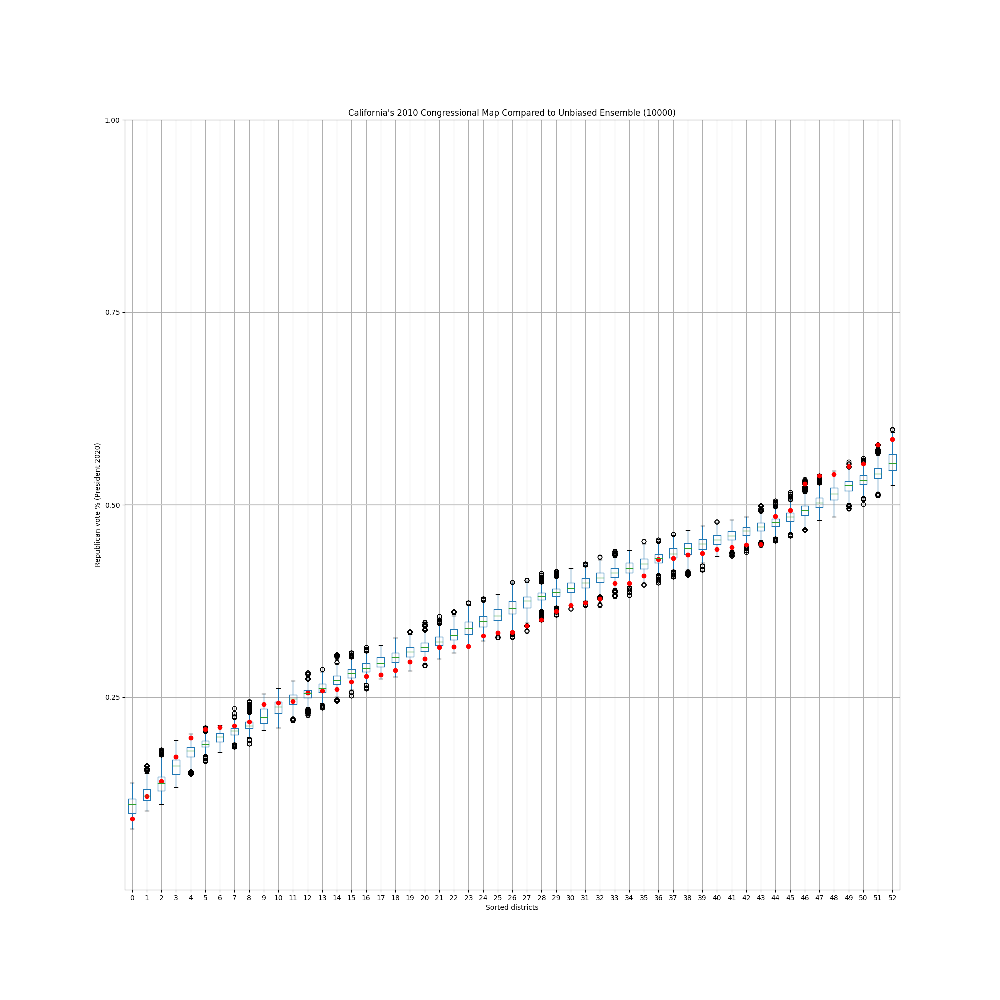

# ca-computational-redistricting

## Results
 

## Data Sources
* Alarm_Redist (2023). Alarm_Redist 2020 Congressional Districts.
Retrieved from https://raw.githubusercontent.com/alarm-redist/census-2020/main/census-vest-2020/ca_2020_block.csv
  * "To produce election data using 2020 precinct boundaries, election results were projected down to the 2010 block level using voting-age population as weights. Results for 2020 blocks were then estimated using 2010 blocks and the land-use-based crosswalk files from VEST. Finally, 2020 blocks were aggregated to 2020 Census VTDs using the Census' 2020 block assignment files."
  * Provides a ready-to-use dataset for tying in 2020 election results with the 2020 census blocks.

* U.S. Census Bureau. (2023). TIGER/Line Shapefiles for 2020 Census Block Groups. Retrieved from https://www2.census.gov/geo/tiger/TIGER2020/TABBLOCK20/tl_2020_06_tabblock20.zip
  * 2020 shapfiles for California.

* U.S. Census Bureau. (2023). Block Assignment Files for California, 2020 Census. Retrieved from https://www2.census.gov/geo/docs/maps-data/data/baf2020/BlockAssign_ST06_CA.zip
  * Connects 2010 congressional districts with 2020 blocks.

* California Citizens Redistricting Commission. (2023). Final Congressional Districts Equivalency File for the 2020 Census. Retrieved from https://wedrawthelines.ca.gov/wp-content/uploads/sites/64/2023/01/CD-Final-equiv.xlsx?emrc=63dc56ef11a47
  * Connects 2021 congressional districts with 2020 blocks.
